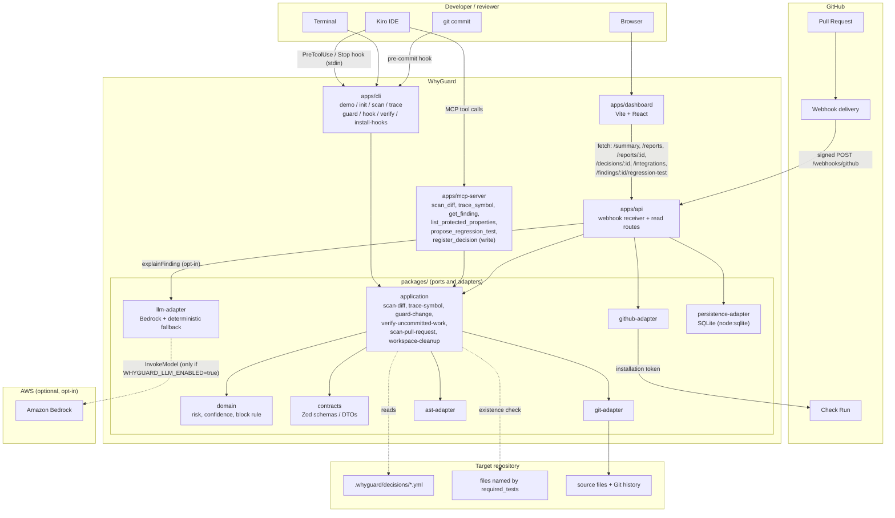

# WhyGuard architecture

How WhyGuard is put together, and why each boundary is where it is.

For what it reads out of a repository, see [Feeding WhyGuard](../guides/feeding-whyguard.md).

## The shape of it, in one paragraph

A deterministic core (`packages/`) turns two versions of a file into scored findings using
only `ts-morph` and `git`. Four thin surfaces call that same core: a CLI, an MCP server, a
Git hook, and a GitHub App webhook receiver. A read-only dashboard renders what the receiver
persisted. Amazon Bedrock is an optional decoration on the output and is never in the
decision path.

## Components



## Ways to run it

| Setup | What runs | Needs |
|---|---|---|
| Local only | `apps/cli`, `apps/mcp-server` | Node and `git`. No network, no account |
| Local + PR checks | above, plus `apps/api` | A GitHub App and a reachable webhook URL |
| Full | above, plus `apps/dashboard` | A host for the API and a static host for the UI |

Each row adds a surface; none of them changes how a decision is reached. The deterministic
core is identical in all three, which is why a finding from a Git hook and a finding from a
Pull Request Check carry the same scores.

## The decision pipeline

One path, four steps, no branching on which surface invoked it.

```text
1. detect     packages/ast-adapter/src/detector.ts
              ts-morph before/after comparison of function-like declarations.
              Emits 5 SensitiveChange kinds. Renaming-invariant: guard clauses are
              matched by a normalized condition signature, so a variable rename does
              not read as a removal.

2. gather     packages/application/src/evidence-gathering.ts
              Four repository-only sources:
                - matching active rationale contract         -> strong
                - contract required_tests present on disk    -> medium (type "test")
                - introducing commit via `git log -S`        -> medium if closing keyword, else weak
                - issue/PR refs in that commit's message     -> medium if closing keyword, else weak

3. score      packages/domain/src/risk.ts
              risk   = weighted sum of six 0..100 factors
              conf   = strongest evidence weight + 5 per corroborating non-weak item (cap +10)
              sever. = >=80 critical, >=60 high, >=35 medium

4. decide     packages/domain/src/risk.ts  decideBlock()
              block requires ALL of: risk>=80, confidence>=75, strong evidence,
              a protected property, that the change weakens it, and NO equivalent
              regression test.
```

Consequence worth stating explicitly, because it defines the product: contract evidence is
the only `strong` evidence the pipeline produces, so **only a human-written decision can
cause a block**. Everything else warns.

## Data flow per surface

**Kiro guardrail** — `kiro` → `PreToolUse` hook → `whyguard hook` → the hook
adapter translates Kiro's snake_case event → `guardChange` → block rule → either a Kiro
`permissionDecision` on STDOUT (`--on-block ask`, the default) or exit `2` with feedback on
STDERR (`--on-block exit-code`). No network, no persistence.

**Git pre-commit** — `git commit` → the installed hook → `whyguard verify --scope staged` →
`getUncommittedChangedFiles` → the same detect/gather/score/decide pipeline → exit `2`, which
Git turns into an aborted commit. `WHYGUARD_SKIP=1` short-circuits, and says so.

**GitHub PR review** — signed webhook → `apps/api` (HMAC verification, delivery
dedup) → `dispatchPullRequestEvent` → `scanPullRequest`:

1. `getPullRequestRefs` (one API call, which also yields the base repository's size);
2. if that size exceeds `WHYGUARD_MAX_REPO_SIZE_MB`, publish a neutral Check Run explaining
   the skip and return a report with `status: "failed"` — never a clean-looking pass — and
   stop before touching disk;
3. otherwise clone into `mkdtempSync` workspace, fetch `refs/pull/<n>/head` (forked PRs);
4. `scanDiff`, then read `.whyguard/decisions/*.yml` while the clone still exists;
5. publish the Check Run; persist report + per-finding explanation;
6. delete the workspace in `finally`.

**Dashboard** — browser → `apps/dashboard` (static) → `apps/api` read routes. Read-only: the
dashboard never triggers a scan and has no write path.

## Clone strategy, and the optimization that was rejected

`cloneRepository` performs a **full** clone with `--no-tags`. Both halves of that are
deliberate.

Not shallow: the evidence engine's job is finding the commit that *introduced* the removed
logic, which is usually far older than the PR. `--depth` would silently degrade every finding
to "no historical reason found", which is worse than failing loudly.

Not a blobless partial clone either — benchmarked against `sindresorhus/got` (1664 commits):

| Clone | On disk | Path-scoped `git log -S` |
|---|---|---|
| full | 5.9 MB | 0.07s |
| `--filter=blob:none --no-tags` | 3.5 MB | 186.58s |

Same result, 2.4 MB saved, ~2600x slower, because the pickaxe round-trips to the remote for
every blob it lacks. A Check on a multi-finding PR would time out. Disk is instead bounded by
two cheap guards: the pre-clone size ceiling above, and `sweepStaleWorkspaces`, which runs at
API startup and removes `whyguard-pr-*` directories older than an hour — the ones left behind
when a process dies mid-scan, which `finally` cannot cover.

## Trust boundaries

- **GitHub webhook payloads are untrusted.** `apps/api/src/webhook-handler.ts` verifies
  `X-Hub-Signature-256` with HMAC-SHA256 and a constant-time comparison
  (`packages/github-adapter/src/webhook-signature.ts`) before parsing the body, and
  deduplicates on `X-GitHub-Delivery`.
- **The read API fails closed.** `apiTokenGuard` compares a bearer token with
  `timingSafeEqual`; with no token configured it answers **loopback clients only**, so a
  public deployment that forgot to set one exposes nothing rather than every analysis. Plus
  per-route rate limiting and security headers (`apps/api/src/security.ts`).
- **Repository files are untrusted.** `packages/ast-adapter` only ever parses content through
  `ts-morph`; nothing in `domain`/`application`/`ast-adapter` executes code from the target
  repository.
- **Git arguments are never concatenated.** `packages/git-adapter` spawns Git with argument
  arrays (`execFile`, no shell), validates refs/SHAs, and rejects paths that resolve outside
  the repository root. Credentials embedded in a clone URL are redacted from any thrown error.
- **WhyGuard never invents evidence.** Every evidence item is derived from something present
  in the analyzed repository. An earlier version consulted a hardcoded fixture keyed on
  `src/payments/create-order.ts` + `createOrder`, which would have told any real repository
  with that ordinary path about an incident that never happened in it — with `strong`
  evidence sufficient to block on its own. Removed, and locked by a regression test.
- **Generated tests are untrusted output.** `buildRegressionTestProposal` returns a string;
  nothing writes it to disk or executes it. The dashboard renders a copy button, never a run
  button.
- **LLM output is untrusted.** `explainFinding` validates against `LlmExplanationSchema` and
  rejects any `usedEvidenceIds` entry absent from the finding, falling back to a deterministic
  template on any failure (network, parse, schema, or citation mismatch).
- **MCP tools are minimal and scoped.** Five read-only tools plus exactly one write tool
  (`whyguard.register_decision`), which requires an explicit `confirm: true` and is never
  placed on an `autoApprove` list.
- **The model never sees the whole repository.** `packages/llm-adapter/src/prompt.ts` scopes
  the prompt to one finding's `change`, `evidence`, and `protectedProperties`.
- **Persisted data carries no server paths.** `scanPullRequest` records
  `{ provider: "github", owner, name }` rather than the ephemeral clone directory, so the
  public read API cannot leak the filesystem layout or the operating user's name.

## Storage

SQLite via `node:sqlite` (`packages/persistence-adapter`), one file, synchronous API. Enough
for a single API instance writing append-mostly analyses. The adapter is a port, so Postgres
or DynamoDB is a swap rather than a rewrite — though every call site is synchronous today, so
the swap also means making them async.

The CLI writes to the same database when one is reachable, best-effort: a persistence failure
never changes an exit code or suppresses the scan's own output, because a tool piping JSON
into another tool must not fail for a bookkeeping reason.
